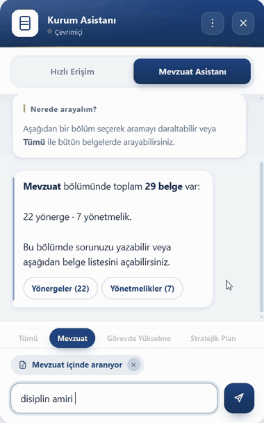
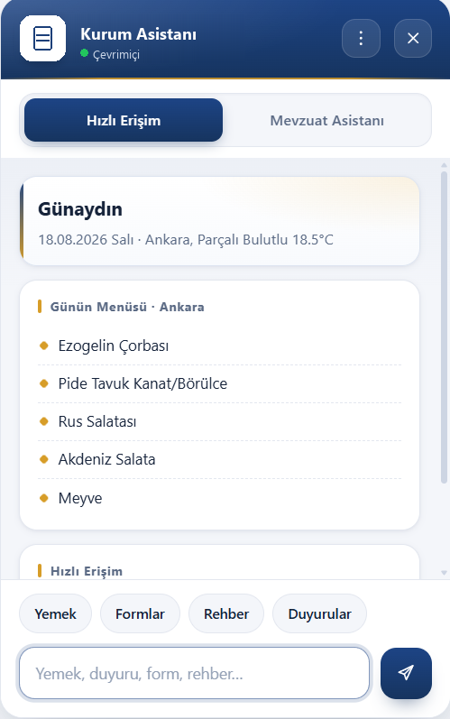
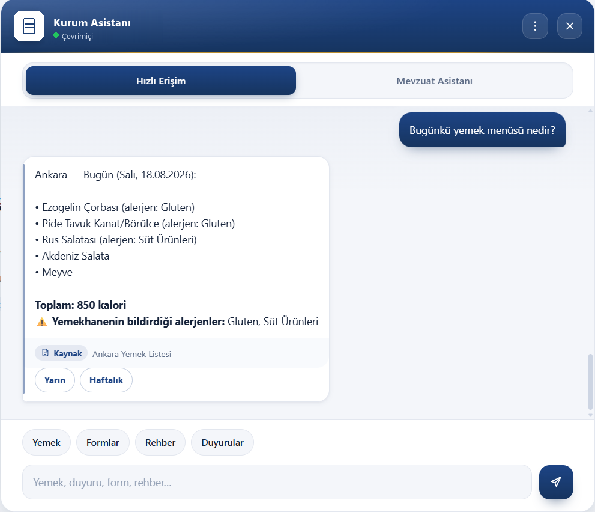
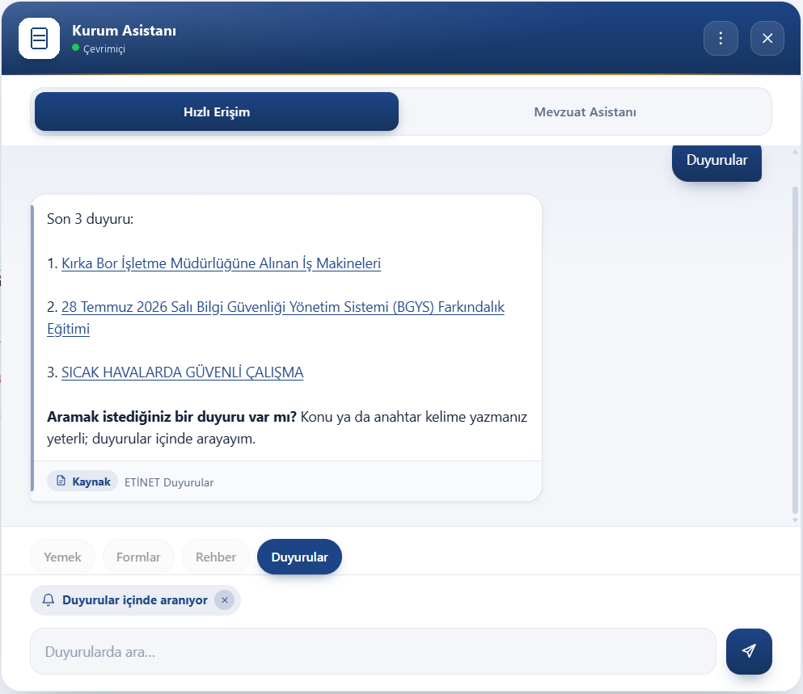
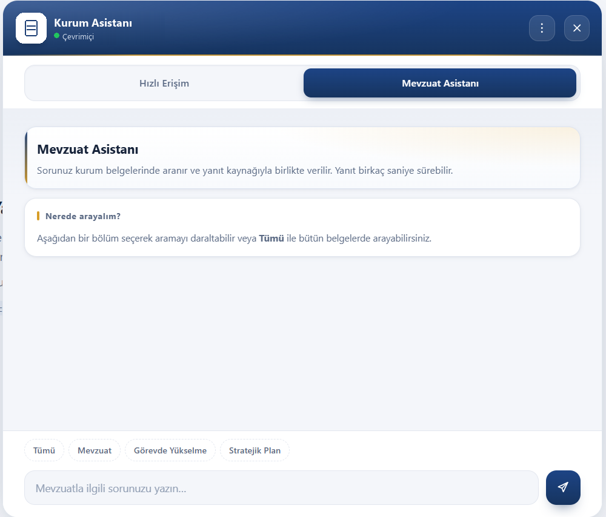
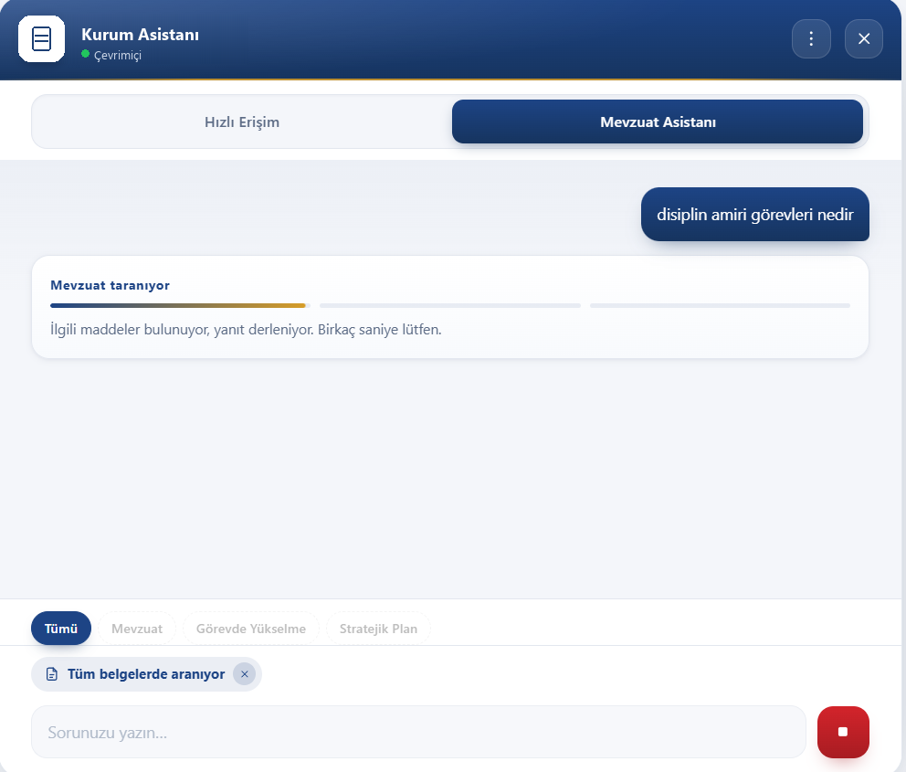
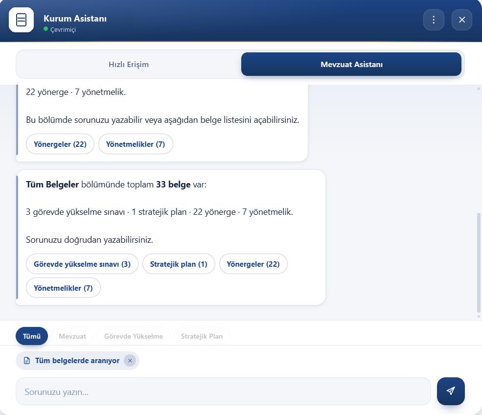
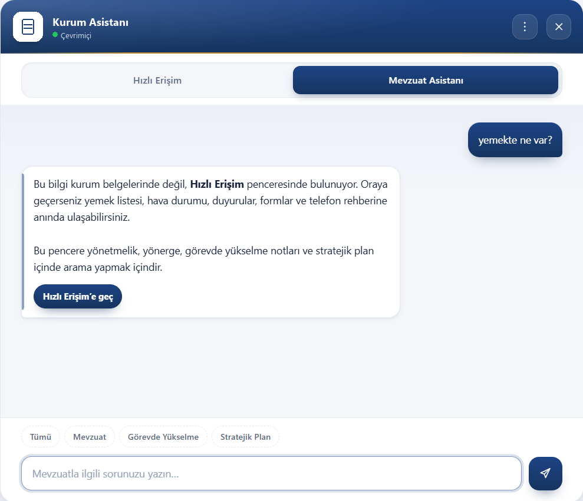
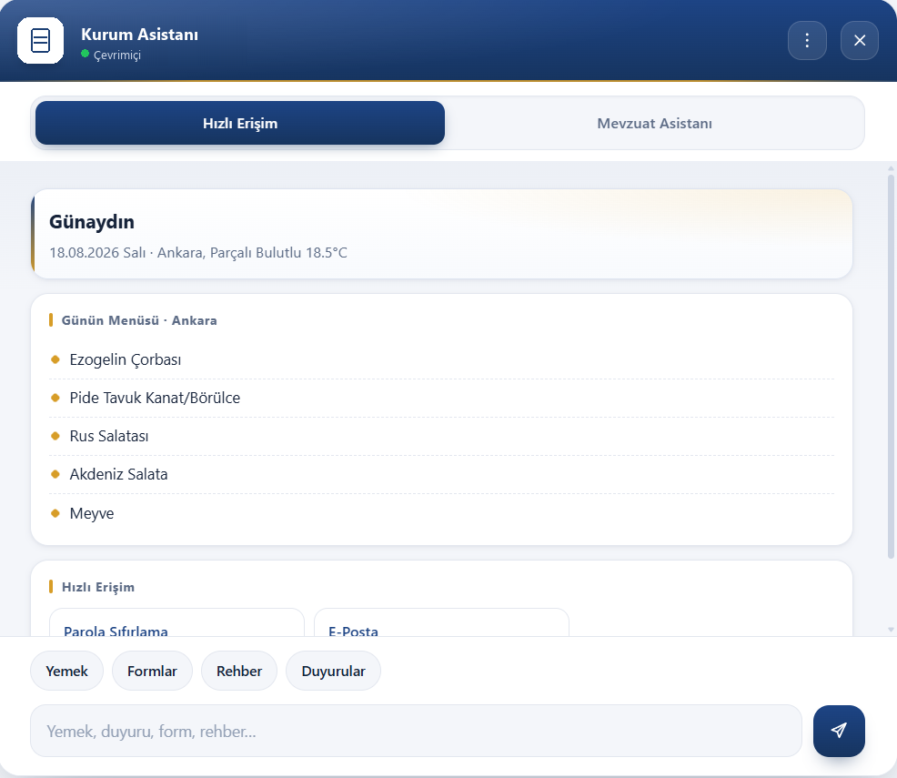
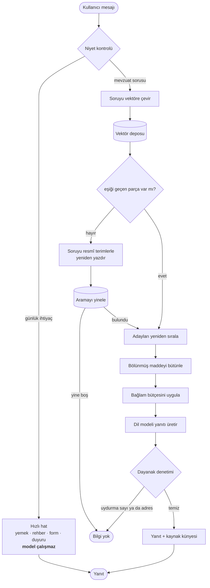

<h1 align="center">Mevzuat Asistanı</h1>

<p align="center">
  <strong>Kurum mevzuatını doğal dille sorabildiğiniz, yanıtı hangi belgeden aldığını gösteren,<br>
  internete hiç çıkmadan kendi sunucunuzda çalışan bir asistan.</strong>
</p>

<p align="center">
  
  
  
  
</p>

<p align="center">
  
  
  
  
  
  
</p>

> **In English —** A fully offline retrieval-augmented assistant for corporate regulations,
> built for a network with no internet access. Employees ask questions in plain Turkish and the
> system finds the relevant article across 30+ regulatory documents, answering with a citation
> to its source. It runs a 4B parameter model locally through llama.cpp, alongside a Turkish
> embedding model and a cross-encoder reranker, plus deterministic checks that reject any answer
> containing numbers or contact details absent from the retrieved text. Documentation is in
> Turkish; the architecture walkthrough lives in [`docs/ARCHITECTURE.md`](docs/ARCHITECTURE.md).

---

## İçindekiler

- [Ne işe yarıyor](#ne-işe-yarıyor)
- [Ekranlar](#ekranlar)
- [Özellikler](#özellikler)
- [Nasıl çalışıyor](#nasıl-çalışıyor)
- [Kullanılan teknolojiler](#kullanılan-teknolojiler)
- [Öne çıkan çözümler](#öne-çıkan-çözümler)
- [Sonuçlar](#sonuçlar)
- [Proje yapısı](#proje-yapısı)
- [Lisans](#lisans)

---

## Ne işe yarıyor

Bir kamu kuruluşunda personelin ihtiyaç duyduğu kurallar otuzdan fazla yönetmelik, yönerge ve
plan belgesine dağılmış durumda. Belgeler kurum portalında yayımlanıyor, içerik de güncel.
Sorun şu: yıllık izninizin kaç gün olduğunu öğrenmek için önce hangi belgede yazdığını tahmin
etmeniz, sonra o belgenin içinde doğru maddeyi bulmanız gerekiyor.

Bu asistan aradaki adımı kaldırıyor. Soruyu gündelik dille yazıyorsunuz, sistem ilgili maddeyi
buluyor ve yanıtın hangi belgeden geldiğini gösteriyor. Kaynağı görmek isteyen tek tıkla
belgeye gidebiliyor.

Aynı arayüz günlük ihtiyaçları da karşılıyor: yemek listesi, telefon rehberi, ortak formlar ve
duyurular. Bu tür sorularda dil modeli hiç çalışmıyor, cevap anında geliyor.

---

## Ekranlar

Aşağıda bir mevzuat sorusunun baştan sona işleyişi var: soru yazılıyor, sistem belgeleri
tarıyor, yanıt dayandığı yönerge ve yönetmelikle birlikte geliyor.

<p align="center">
  
</p>

<p align="center">
  <sub>Yanıtın beklendiği bölüm kayıtta hızlandırıldı; gerçek süre birkaç saniyedir.</sub>
</p>

Arayüz, mevcut portal sayfasına tek bir betik etiketiyle eklenen bağımsız bir bileşen. Köşedeki
düğmeyle açılıyor ve iki pencere sunuyor.

### Hızlı Erişim

Açılışta karşılayan panel; selamlama, hava durumu, günün menüsü ve sık kullanılan bağlantılar
tek bir sunucu isteğiyle geliyor. Alttaki düğmeler yazı yazmadan yemek, form, rehber ve
duyurulara ulaşmayı sağlıyor.

<p align="center">
  
</p>

Yemek sorulduğunda yanıtın altında alerjen bilgileri, günün toplam kalorisi ve kaynak künyesi
yer alıyor. "Yarın" ve "Haftalık" düğmeleri aynı soruyu tekrar yazma ihtiyacını ortadan
kaldırıyor.

<p align="center">
  
</p>

Duyurular düğmesi son duyuruları listelerken bir arama kipi de açıyor. Kipin açık olduğu, yazı
kutusunun üstündeki çipten anlaşılıyor; kullanıcı çipin üzerindeki işaretle tek tıkla
çıkabiliyor.

<p align="center">
  
</p>

### Mevzuat Asistanı

Mevzuat penceresi boş bir yazı kutusuyla değil, ne yapabileceğini anlatan bir kartla açılıyor.
Kullanıcı aramayı bir bölümle daraltabiliyor ya da tüm belgelerde arayabiliyor.

<p align="center">
  
</p>

Soru sorulduğunda yanıt saniyeler sürebildiği için ilerleme göstergesi çıkıyor ve gönder düğmesi
durdurma düğmesine dönüşüyor. Beklemekten vazgeçen kullanıcı üretimi kesebiliyor.

<p align="center">
  
</p>

Bölüm düğmeleri hangi kapsamda kaç belge olduğunu gösteriyor; kullanıcı isterse belge listesini
açıp doğrudan bir belgeye gidebiliyor.

<p align="center">
  
</p>

### Pencereler arası yönlendirme

Yanlış pencereye yazılan soru cevapsız bırakılmıyor. Mevzuat penceresine yazılan bir yemek
sorusu orada yanıtlanmıyor; kullanıcıya durumun açıklaması ve tek tıkla geçiş düğmesi
sunuluyor. Tersi de geçerli.

<p align="center">
  
</p>

### Geniş kip

Uzun mevzuat maddeleri dar pencerede aşırı uzayıp takibi zorlaştırdığı için ikinci bir yerleşim
eklendi. Geniş kipte yalnızca pencere büyümüyor; iç boşluklar açılıyor, hızlı erişim
bağlantıları tek sütun yerine üç sütuna yayılıyor ve sohbet balonlarının azami genişliği
yeniden ayarlanıyor.

<p align="center">
  
</p>

> Ekran görüntülerindeki kurum adı ve logo, depo herkese açık olduğu için nötr bir başlıkla
> değiştirildi. Arayüzün geri kalanı olduğu gibi.

---

## Özellikler

**Kaynak gösteren yanıtlar.** Her mevzuat yanıtının altında dayandığı belgenin künyesi var ve
künye belgenin kendisine bağlı. Bağlantısı bulunamayan belge, uydurma bir bağlantı yerine düz
metin olarak gösteriliyor.

**Bilmediğinde bilmediğini söyleme.** Hiçbir belge parçası benzerlik eşiğini geçemezse sistem
zayıf bir eşleşmeden cevap uydurmak yerine kayıtlı bilgi olmadığını söylüyor.

**Uydurma bilgiye karşı kod düzeyinde denetim.** Yanıt üretildikten sonra içindeki sayılar ve
iletişim bilgileri, modele verilen metinde gerçekten geçip geçmediğine bakılarak denetleniyor.
Geçmiyorsa yanıt kullanılmıyor.

**Kapsam daraltma.** Arama tüm belgelerde ya da tek bir bölümde yapılabiliyor. Bölüm
seçildiğinde sistemin hiçbir yolu o bölümün dışına çıkmıyor.

**Soruyu anlamadığında yeniden yorumlama.** Gündelik dille yazılan bir soru karşılık bulamazsa
soru resmî terminolojiyle yeniden yazdırılıp arama tekrarlanıyor. Yanıt bu şekilde bulunduysa
kullanıcıya söyleniyor.

**Günlük ihtiyaçlar için hızlı hat.** Yemek, hava durumu, rehber, form ve duyuru sorularında dil
modeli devreye girmiyor; cevap anında geliyor.

**Eşzamanlı kullanıcı desteği.** Birden çok istek paralel karşılanıyor. Sistem doluysa kullanıcı
süresiz bekletilmek yerine açıkça bilgilendiriliyor.

**Üretimi durdurma.** Uzun süren bir yanıttan vazgeçilebiliyor ve iptal sunucu tarafında da
gerçekten uygulanıyor.

**Belgeler değiştiğinde otomatik güncelleme.** Açılışta yalnızca değişen dosyalar yeniden
işleniyor; değişiklik yoksa eşitleme milisaniyeler sürüyor.

**Tamamen çevrimdışı.** Dil modeli, gömme modeli ve yeniden sıralayıcı diskten okunuyor. Çalışma
anında hiçbir dış servise istek gitmiyor.

---

## Nasıl çalışıyor

Gelen her mesaj önce niyet kontrolünden geçiyor. Günlük ihtiyaç sorulduysa hızlı hat yanıtlıyor;
mevzuat sorusuysa asıl zincir devreye giriyor.



Katmanlar birbirinden bağımsız test edilebilecek şekilde ayrıldı. Arama, dil modeli hiç
yüklenmeden çalıştırılabiliyor; benzerlik eşiği tek kelime üretilmeden ölçülebiliyor; yanıtın
dayanaklı olup olmadığı modele sorularak değil kodla kontrol ediliyor.

---

## Kullanılan teknolojiler

| Katman | Seçim | Gerekçe |
| :-- | :-- | :-- |
| Sunucu | FastAPI | Modeller her istekte değil, açılışta bir kez yükleniyor. Asenkron çalıştığı için bir yanıt üretilirken diğer isteklere cevap verilebiliyor. |
| Dil modeli | `Qwen3.5-4B-Q4_K_M`, llama.cpp | Tek dosyalık GGUF, ekran kartı olmadan da çalışabilmesi, model dosyasının önceden indirilip taşınabilmesi. |
| Gömme modeli | `turkish-e5-large` | Türkçe için eğitilmiş. Seçim sıralama tablosuna göre değil, ölçülen ayrışma marjına göre yapıldı. |
| Yeniden sıralayıcı | `modernbert-tr-reranker` | Aday havuzunu daha isabetli sıralamak için. |
| Vektör veri tabanı | ChromaDB | Dosya tabanlı, ayrı sunucu süreci gerektirmiyor. Kapalı ağda kurulacak her ek servis fazladan yük. |
| Belge okuma | pypdf, python-docx + tablo ayrıştırma | Tablolar düz metne çevrilmiyor, satır satır işleniyor. |
| Arayüz | Saf JavaScript + CSS değişkenleri | Portal sayfasına tek betik etiketiyle gömülüyor. Arayüz çatısı eklemek portalın kendi betikleriyle çakışma riski taşıyordu. |
| Yapılandırma | Tek YAML dosyası, tipli ayar nesnesi | Yanlış yazılmış bir ayar adı sessizce varsayılana düşmek yerine açılışta hata veriyor. |

---

## Öne çıkan çözümler

Projede en çok emek isteyen dört konu şunlar oldu. Ayrıntılar, ölçümler ve kod örnekleri
[`docs/ARCHITECTURE.md`](docs/ARCHITECTURE.md) dosyasında.

**Mevzuata özel parçalama.** Belgeler sabit karakter sayısına göre değil, belgenin kendi koyduğu
sınırlara göre bölünüyor: madde işaretleri, numaralı konu başlıkları, harflendirilmiş bentler ve
tablo satırları. Sabit bölmede bir hükmün koşulu bir parçada, istisnası başka parçada
kalabiliyordu. Ayrıca konu başlığı o bölümün her parçasına önek olarak ekleniyor; aksi hâlde ilk
parçadan sonrakiler konularını kaybediyor.

**İki aşamalı arama.** Gömme modeli binlerce parça arasından küçük bir aday havuzu çıkarıyor,
cross-encoder bu havuzu yeniden sıralıyor. İkinci aşamanın gerekçesi şu: belge sayısı arttıkça
tek bir benzerlik eşiği, ilgili ve ilgisiz soruları ayırt etme gücünü kaybediyor.

**Yanıtın denetlenmesi.** Sistem talimatına "uydurma" yazmak yeterli bir güvence değil. Yanıt
üretildikten sonra içindeki her sayı ve her iletişim bilgisi, modele verilen metinde aranıyor;
dayanağı olmayan bir değer varsa yanıt reddediliyor.

**Eşzamanlılık.** Süreç içinde birden çok model bağlamı açan bir işleyici havuzu kuruldu. Model
ağırlıkları bellek eşlemeyle paylaşıldığı için ek işleyici ek bellek anlamına gelmiyor. Havuz
doluysa istek sıraya alınmak yerine reddediliyor; sistem yük altında kilitlenmiyor.

---

## Sonuçlar

| Ölçüt | Başlangıç | Son |
| :-- | :--: | :--: |
| Doğru paragrafı ilk sırada bulma (R@1) | 0,84 | **0,87** |
| Sıralama kalitesi (MRR) | 0,906 | **0,930** |
| Kapsam içi ve kapsam dışı soruların ayrışması | −0,120 | **+0,125** |
| Yanlış madde atfı (10 soruluk küme) | 2 | **0** |
| Bilmesi gerekirken reddettiği soru | 1 | **0** |
| Alıntı sadakati | 4/6 | **6/6** |
| Uçtan uca test | — | **65/65** |

Sayılar projenin kendi ölçüm betiklerinden geliyor; sabit bir belge kümesi ve sabit bir soru
listesi üzerinde ölçüldüler. Hangi ölçümün neyi gösterdiği
[`docs/ARCHITECTURE.md`](docs/ARCHITECTURE.md) içinde.

---

## Proje yapısı

```
regulatory-rag-assistant/
├── README.md
├── LICENSE
├── .gitignore
├── requirements.txt          ← Python bağımlılıkları, sürümleri sabitlenmiş
├── package.json              ← arayüz bileşeni üstverisi
├── docs/
│   └── ARCHITECTURE.md       ← katmanlar, çözümler, ölçümler, kod örnekleri
└── assets/                   ← arayüz görselleri
```

Uygulama katmanlara ayrılmış: yapılandırma ve metin yardımcıları, HTTP uç noktaları, servisler
(yönlendirme, erişim, üretim, veri çekimi, formlar) ve arayüz dosyaları. Ayrıca her biri farklı
bir katmanı ölçen altı doğrulama betiği var.

| Bileşen | Kod satırı |
| :-- | --: |
| Servisler (erişim, üretim, yönlendirme, veri çekimi) | ~2.400 |
| Arayüz (JS + CSS) | ~1.900 |
| Çekirdek, uç noktalar, yardımcılar | ~400 |
| Ölçüm betikleri | ~1.100 |

Kaynak kodun kendisi burada yer almıyor; kurum içi bir çalışma olduğu için mimari, ölçümler ve
sadeleştirilmiş kod örnekleri paylaşıldı.

---

## Lisans

MIT — bkz. [LICENSE](LICENSE).
