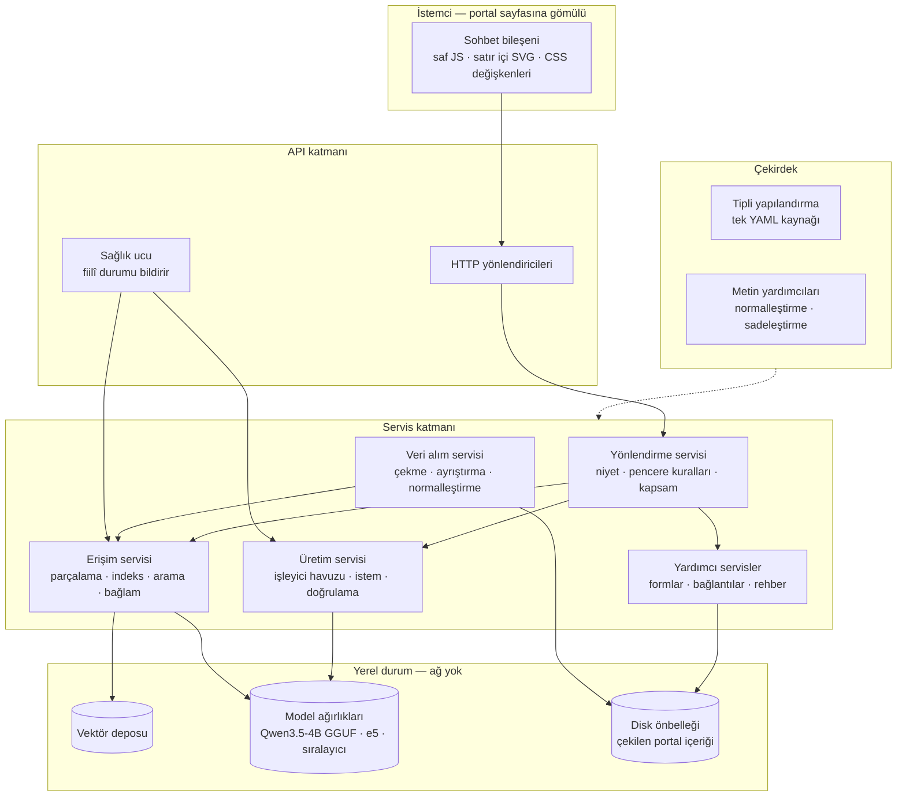
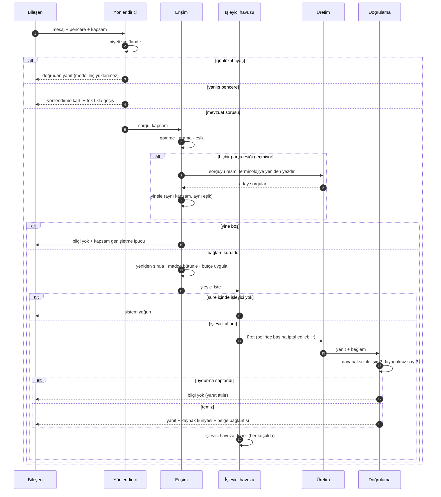
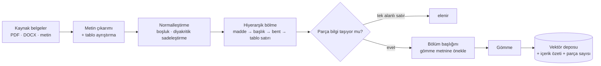
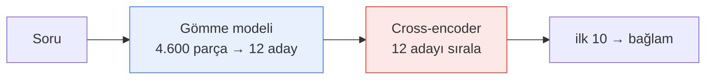
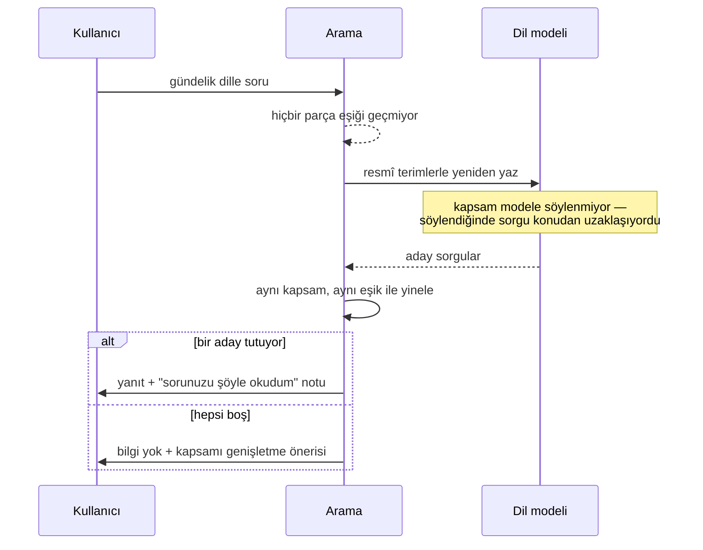
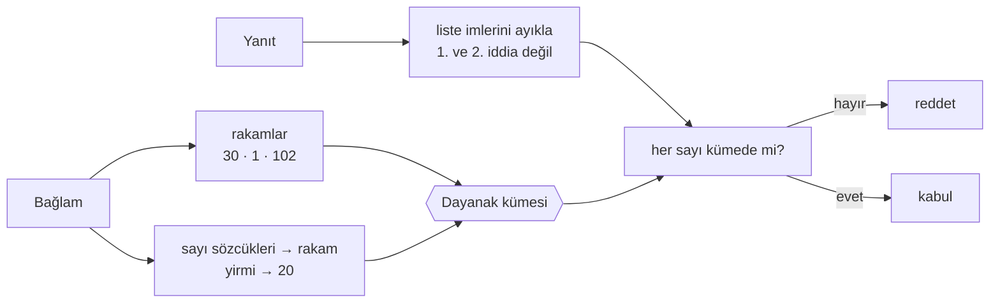
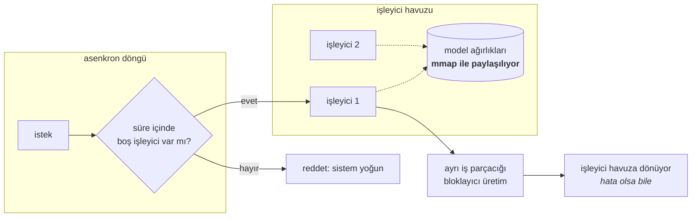
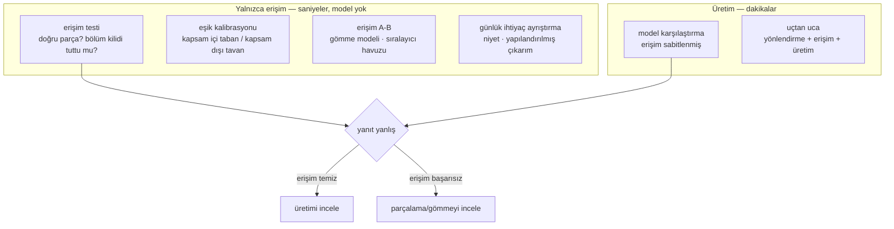

# Mimari

README'deki tanıtımın devamı: katmanların sınırları, bir isteğin baştan sona izlediği yol,
öne çıkan çözümlerin ayrıntıları ve bunları doğuran ölçümler.

---

## İçindekiler

- [Katmanlar](#katmanlar)
- [Bir isteğin yaşam döngüsü](#bir-isteğin-yaşam-döngüsü)
- [Belgelerin parçalanması](#belgelerin-parçalanması)
- [Arama](#arama)
- [Soru anlaşılmadığında](#soru-anlaşılmadığında)
- [Yanıtın denetlenmesi](#yanıtın-denetlenmesi)
- [Model ayarları](#model-ayarları)
- [Eşzamanlı istekler](#eşzamanlı-istekler)
- [Vektör indeksinin güncellenmesi](#vektör-indeksinin-güncellenmesi)
- [Hata kipleri](#hata-kipleri)
- [Ölçümler](#ölçümler)
- [Test edilebilirlik](#test-edilebilirlik)
- [Operasyonel yüzey](#operasyonel-yüzey)
- [Dağıtım](#dağıtım)

---

## Katmanlar



En kritik sınır **yönlendirme**, **erişim** ve **üretim** arasında. Bunları ayrı servisler
yapmanın sebebi düzen kaygısı değil: kötü bir yanıtın hangisinden kaynaklandığı net olarak
söylenebilmeli, ve erişim dil modeli yüklenmeden çalıştırılabilmeli.

| Katman | Sahiplendiği | Bilinçli olarak sahiplenmediği |
| :-- | :-- | :-- |
| Yönlendirme | Niyet sınıflandırma, pencere kuralları, kapsam çözümleme, reddetme metinleri | Gömme ya da istem hakkında hiçbir bilgi |
| Erişim | Parçalama, indeksleme, arama, eşikleme, yeniden sıralama, bağlam kurma | Dil modeline dair hiçbir şey |
| Üretim | İşleyici havuzu, istem kurulumu, çözümleme, dayanak doğrulama | Bağlamın nereden geldiği bilgisi |
| Veri alımı | Çekme, ayrıştırma, tablo çıkarımı, normalleştirme | Sorgu anındaki davranış |
| Çekirdek | Tipli yapılandırma, metin normalleştirme | İş mantığı |

---

## Bir isteğin yaşam döngüsü



Bu akışta üç şey önemli.

**Model, trafiğin çoğu için devrede değil.** Günlük ihtiyaçlar hiçbir ağırlığa dokunulmadan
çözülüyor; hızlı pencerenin anında cevap vermesi, belge penceresinin saniyeler alması bundan.

**Kapsam tek yerde uygulanıyor.** İlk arama, yeniden yazılmış yineleme, belge önerisi — hepsi
aynı filtreden geçiyor. Eski bir sürümde filtre yalnızca ilk aramada uygulanıyordu; devreye
giren bir takip mekanizması aramayı filtresiz yineliyor ve bir bölüm içinde sorulan soru başka
bölümden yanıtlanıyordu.

**Doğrulama üretimden sonra, bitmiş metin üzerinde çalışıyor.** İstemin parçası olmadığı için
ustaca kurulmuş bir soruyla atlatılamıyor.

---

## Belgelerin parçalanması



Parçalama sabit karakter sayısına göre değil, belgenin kendi koyduğu sınırlara göre yapılıyor:

```
Madde işareti          "MADDE 17 – ..."
Numaralı konu başlığı  "10. YENİ İŞ ARAMA İZNİ: ..."     ← madde işareti olmayan belgeler için
Harflendirilmiş bent   "d) Başmühendis pozisyonuna ..."   ← koşullu
Tablo satırı           "etiket — sütun: değer"            ← her satır bir parça
```

Sabit bölmede maddeler ortadan kesiliyordu: bir sınav konuları listesi bir parçada "7) İcra
İflas Hukuku" ile bitiyor, sonraki parça "8) Vergi Hukuku" ile başlıyor ve model listenin başını
hiç görmüyordu.

### Başlık öneki

Konu başlığı yalnızca kendi bölümünün ilk parçasında geçiyor, sonraki parçalar konusunu
kaybediyor. "Yeni iş arama izni" sorgusu İş Kanunu'nun ilgili bölümü yerine maden arama
ruhsatıyla ilgili bir maddeyi döndürüyordu; doğru metin indekste vardı ama 1.099 karakterlik bir
parçanın ortasında, konusu bambaşka bir metinle aynı vektörde duruyordu. Her parça bölüm
başlığıyla birlikte gömülünce:

| Sorgu | Önce | Sonra |
| :-- | :-- | :-- |
| yeni iş arama izni | yanlış madde, 0,479 | doğru bölüm, 0,569 |
| mazeret izni kaç gündür | bulunamadı | doğru bölüm, 0,565 |
| süt izni ne kadar | bulunamadı | doğru bölüm, 0,651 |

### Bent bölmesi

Mevzuat şartları kadro kadro harflendiriyor: `(a)` birim müdürünün şartı, `(d)` başmühendisinki.
5.500 karakterlik madde bütün hâlde verildiğinde model sorulan kadronun ilk geçtiği yere
kilitlenip yanlış bentten cevap veriyor, üstelik kaynağını da yanlış söylüyordu. İstem kuralı
yazmak çözmedi; modelin rakip bentleri hiç görmemesi çözdü.

Bölme koşullu: madde 1.500 karakteri geçmeli ve en az üç bent içermeli. Aksi hâlde "a) Uyarma,
b) Kınama" gibi kısa sayımlar da parçalanıyor ve bağlam gereksiz yere dağılıyor.

```python
MIN_MADDE_KARAKTER = 1500   # bunun altındaki madde bütün kalır
MIN_BENT_SAYISI    = 3      # kısa sayımları bölmek bağlamı parçalar


def maddeyi_bol(madde_no: str, konu: str, govde: str) -> list[Parca]:
    """Çok kadrolu bir maddeyi bentlerine ayırır."""
    if len(govde) < MIN_MADDE_KARAKTER:
        return [Parca(madde_no, konu, govde)]

    bentler = list(BENT_DESENI.finditer(govde))
    if len(bentler) < MIN_BENT_SAYISI:
        return [Parca(madde_no, konu, govde)]

    # İlk bentten önceki kısım maddenin açılış cümlesi ("MADDE 8 – (1) özel
    # şartlar aşağıda belirtilmiştir:"). Her bende taşınıyor; tek başına duran
    # bir bent hangi maddeye ait olduğunu söylemiyor.
    acilis = normalize(govde[: bentler[0].start()])

    parcalar = []
    for sira, esles in enumerate(bentler):
        son = bentler[sira + 1].start() if sira + 1 < len(bentler) else len(govde)
        metin = govde[esles.start():son].strip()
        parcalar.append(Parca(
            madde_no=madde_no,
            # Bendin açılışı hem başlığı oluyor hem de gömme metnine önek
            # olarak giriyor.
            konu=normalize(esles.group("acilis")),
            metin=f"{acilis} {metin}" if acilis else metin,
        ))
    return parcalar
```

### Tablolar

Tablolar düz metne çevrilmiyor; her satır kendi parçası oluyor. Düz metne çevrildiğinde dört beş
gösterge tek parçaya doluyor ve hiçbiri aranabilir olmuyordu. Tek istisna, tek değer taşıyan
satırlar: kesik etiketli böyle bir satır ("BİGMAP … — 2018: 15") alakasız bir soruya 0,482 skor
verip ayrışma marjını negatife düşürmüştü, artık indekse alınmıyorlar.

### Üstveri

Her parça dört bilgi taşıyor: göreli dosya yolu (dosya adı değil, iki dizin aynı adı
taşıyabilir), kaynak dosyanın içerik özeti, maddenin belge içindeki sıra numarası ve o belge
için beklenen toplam parça sayısı. Sonuncusu, yarıda kesilmiş bir gömme işleminin eksik belgeyi
tamamlanmış göstermesini engelliyor.

---

## Arama

Arama iki aşamalı. Gömme modeli 4.600 parça arasından 12 aday çıkarıyor (~38 ms), cross-encoder
bu 12 adayı yeniden sıralıyor (~1,1 sn) ve ilk 10 tanesi bağlama giriyor.



Aday havuzunun boyutu taranarak seçildi. 8'den sonrası isabeti düşürüyor:

| Havuz | R@1 | MRR | ms/soru | |
| :--: | :--: | :--: | --: | :-- |
| kapalı | 0,84 | 0,906 | 38 | yalnızca gömme |
| 6 | 0,87 | 0,930 | 740 | |
| **8** | **0,87** | **0,930** | **1108** | **seçilen** |
| 12 | 0,84 | 0,914 | 1674 | |
| 20 | 0,84 | 0,914 | 2991 | |

Havuzun altı olduğu bir ölçümde doğru paragraf gömme sıralamasında sekizinci sıradaydı ve hiç
görünmemişti; sekize çıkarılınca birinci sıraya geldi.

Kapsam kararı yeniden sıralayıcıya bırakılmadı, benzerlik eşiğinde kaldı. Rerank skoru için
ölçülen marj havuz boyutuna göre −0,030 ile +0,170 arasında zıplıyor; tek bir sorunun değeri
uçurabildiği bir istatistiğe eşik bağlanamazdı.

Kodda iki noktaya dikkat etmek gerekiyor: ChromaDB benzerlik değil **mesafe** döndürüyor, ve tek
adayı yeniden sıralamak boşa geçen bir saniye.

```python
def ara(self, sorgu: str, kapsam: str | None, top_k: int) -> list[Isabet]:
    sonuc = self.koleksiyon.query(
        query_embeddings=[self.gomme.sorgu_gom(sorgu)],
        n_results=self.rerank_havuzu,        # sıralayıcıya aday lazım, fazladan çekiliyor
        where=self._kapsam_filtresi(kapsam), # kapsam tek yerde, her yol için uygulanıyor
    )

    isabetler = []
    for belge, meta, mesafe in zip(*satirlar(sonuc)):
        # Depo kosinüs MESAFESİ döndürüyor (0 = birebir aynı). Eşiği doğrudan
        # mesafeyle karşılaştırmak filtreyi tersine çevirir.
        benzerlik = 1.0 - mesafe
        if benzerlik < self.benzerlik_esigi:
            continue                          # kapsam dışı
        isabetler.append(Isabet(belge, meta, benzerlik))

    # Tek adayın sırası değişemez.
    if self.siralayici and len(isabetler) > 1:
        isabetler = self.siralayici.yeniden_sirala(sorgu, isabetler)

    return isabetler[:top_k]
```

Bağlam kurulurken isabetler alaka sırasıyla ekleniyor ve bütçeye sığmayan atlanıyor. Burada
başta `break` vardı ve tek bir uzun madde arkasındaki her şeyi düşürüyordu: 6.598 karakterlik
bir madde sığmayınca sonraki üç isabet (198, 1.648 ve 574 karakter) hiç eklenmemiş, 7.000'lik
bütçenin yalnızca 2.468'i kullanılmış ve ilgili yönetmelik kaynak listesinden düşmüştü.

---

## Soru anlaşılmadığında

Aramanın boş döndüğü durumların çoğunda sorun bilgi eksikliği değil, ifade farkıydı:

```
"işe geç gelmek"           → en yüksek skor 0,456 → bilgi yok
"işe geç gelmenin cezası"  → 0,537 · Disiplin Yönergesi md. 9
```

Aynı belge, aynı indeks, aynı eşik. Bu yüzden arama boş döndüğünde soru modele resmî
terminolojiyle yeniden yazdırılıyor ve arama tekrarlanıyor.



Dört sınır kondu:

- Yalnızca arama başarısızken çalışıyor, başarılı akışa maliyet eklemiyor.
- Kullanıcı aramayı bir bölümle sınırladıysa yineleme de o bölümde kalıyor.
- Eşik oynatılmıyor; model konudan saparsa sonuç yine boş dönüyor.
- Yanıt yeniden yorumlanmış bir soruyla bulunduysa kullanıcıya söyleniyor.

---

## Yanıtın denetlenmesi

Yanıt üretildikten sonra iki denetim çalışıyor. İkisi de gerçekten yaşanmış hatalardan doğdu.

**Uydurma iletişim bilgisi.** Model bir keresinde gerçekçi görünen bir kurum e-posta adresi
üretti. Korpusta hiç "@" işareti yok, adres tamamen uydurmaydı; yanında gerçek bir kaynak
künyesi durduğu için de inandırıcı görünüyordu. Artık yanıttaki her e-posta, alan adı ve telefon
bağlamda birebir aranıyor, bulunamazsa yanıt kullanılmıyor.

**Uydurma sayı.** Mevzuat yanıtlarının çoğu sayıya dayanıyor. Bir ölçümde bağlamda "yirmi gün"
ve "30 gündür" yazıyordu, model "24-30 gün arasında olabilir" dedi. 24 hiçbir yerde geçmiyor;
erişim kusursuzdu, hata üretimdeydi.



Liste imleri önce temizleniyor, çünkü numaralandırılmış bir "1." sayısal bir iddia değil. Baştaki
sıfırlar da normalleştiriliyor; "05" ile "5" aynı sayı.

```python
async def soruyu_yanitla(self, soru: str, kapsam: str | None) -> Yanit:
    baglam, kaynaklar = await self.getir(soru, kapsam)
    yeniden_yazildi = False

    if not baglam and len(soru.split()) >= YENIDEN_YAZMA_ASGARI_KELIME:
        for aday in await self.llm.sorguyu_yeniden_yaz(soru):
            # Aynı kapsam, aynı eşik.
            baglam, kaynaklar = await self.getir(aday, kapsam)
            if baglam:
                yeniden_yazildi = True
                break

    if not baglam:
        return Yanit(BILGI_YOK, ipucu=self._kapsam_genislet_ipucu(kapsam))

    yanit = await self.llm.uret(soru, baglam)

    if uydurma := dayanaksiz_iletisim(yanit, baglam):
        log.warning("bağlamda olmayan iletişim bilgisi %r — yanıt reddedildi", uydurma)
        return Yanit(BILGI_YOK)

    if uydurma := dayanaksiz_sayi(yanit, baglam):
        log.warning("dayanağı olmayan sayı %r — yanıt reddedildi", uydurma)
        return Yanit(BILGI_YOK)

    if yeniden_yazildi:
        yanit += f"\n\n{YORUM_NOTU}"

    return Yanit(yanit, kaynaklar=kaynaklar)
```

---

## Model ayarları

| Ayar | Değer | Gerekçe |
| :-- | :--: | :-- |
| `temperature` | `0.0` | Aynı soru her zaman aynı yanıtı vermeli. 0,1'de aynı soru iki farklı yazımla iki farklı cevap üretiyordu. |
| `repeat_penalty` | `1.05` | 1,1'de model eşanlamlı arayıp kanun ifadesini bozuyor; mevzuatta terimler tekrar etmek zorunda. |
| `max_tokens` | `640` | 320'de uzun madde listeleri ortadan kesiliyor, kullanıcı eksik yanıtı tam sanıyordu. |
| `n_ctx` | `6144` | Bağlam bütçesine göre ayarlandı. Taşarsa llama.cpp istemin başını, yani sistem talimatını sessizce atıyor. |
| bağlam bütçesi | 7.000 karakter | Gecikmenin yaklaşık %85'i istem işlemeden geliyor. |
| düşünme kipi | kapalı | Model varsayılan olarak gizli bir akıl yürütme bloğu üretiyor; kullanıcıya gösterilmediği için her belirteci gecikme. |

Sistem talimatı istemin en başında ve sabit tutuluyor, böylece llama.cpp bu öneki KV
önbelleğinden yeniden kullanabiliyor. Düşünme kipi için modelden rica etmek yerine istem, boş ve
kapatılmış bir düşünme bloğunu önceden yazıyor.

Model seçimi ölçümle yapıldı (10 soru, 4 hata türü):

| Model | uydurma sayı | yanlış atıf | aşırı reddetme | alıntı sadakati | sn/soru |
| :-- | :--: | :--: | :--: | :--: | --: |
| Qwen2.5-3B Q4_K_M | 1 | 2 | 1 | 4/6 | 1,3 |
| **Qwen3.5-4B Q4_K_M** | **1** | **0** | **0** | **6/6** | 10,2 |

4B modeli, kod tarafında yakalanamayan tek hata türünü kapattığı için seçildi. Uydurma sayıyı
denetim yakalıyor ama yanlış atfı yakalayamıyor: yanıttaki bütün sayılar bağlamda gerçekten
geçiyor, sadece yanlış hükmün altında. Gecikme bedeli bu yüzden kabul edildi.

7B'lik kod odaklı bir model de denendi, bu işte 4B'nin gerisinde kaldı.

---

## Eşzamanlı istekler

Hiçbir önlem yokken ölçülen durum:

```
1 kullanıcı                        6,9 sn
4 kullanıcı  →  2,3 · 7,2 · 17,4 · 26,3 sn
```

N'inci kullanıcı yaklaşık N × 6,5 saniye bekliyordu. Üretim ayrı bir iş parçacığına taşındı ve
süreç içinde birden çok llama.cpp bağlamı açan bir işleyici havuzu kuruldu.



Model ağırlıkları bellek eşlemeyle paylaşılıyor, yani iki işleyici iki kopya demek değil;
işleyici başına ek maliyet sadece kendi KV önbelleği.

Kuyruk sınırsız değil: belirlenen süre içinde işleyici boşalmazsa istek reddediliyor ve
kullanıcıya sistemin yoğun olduğu söyleniyor.

Çekirdekler işleyicilere bölünmüyor. Sezgisel olan bölüşüm tek kullanıcının gecikmesini
kötüleştirdi, çünkü tek istek varken çekirdeklerin yarısı boşta kalıyor:

| Kurulum | Tek kullanıcı |
| :-- | --: |
| 8 iş parçacığı, 1 işleyici | ~25 sn |
| 4 iş parçacığı, 2 işleyici | ~47 sn |

İptal işlemi ayrı bir sorundu. Asenkron görevi iptal etmek iş parçacığını durdurmuyor; llama.cpp
sonuna kadar üretmeye devam edip işleyiciyi meşgul tutuyordu. Çözüm, kütüphanenin her belirteçten
sonra çağırdığı durdurma ölçütüne isteğe özel bir iptal bayrağı bağlamak oldu. Bayrağın isteğe
özel olması şart: yeniden kullanılsaydı önceki iptalden kalan işaret yeni isteği daha başlamadan
öldürürdü. Ölçümde iptal komutundan yaklaşık 4,5 saniye sonra üretim gerçekten duruyor.

---

## Vektör indeksinin güncellenmesi

Her açılışta bütün belgeleri yeniden gömmek dakikalar sürüyordu. Artık her parça kaynak
dosyasının içerik özetini taşıyor ve açılışta sadece değişenler işleniyor: yeni dosya gömülüyor,
değişmiş dosya yeniden gömülüyor, silinmiş dosyanın parçaları düşürülüyor. Değişiklik yoksa
eşitleme 10-13 milisaniyede bitiyor.

Zaman damgası yerine içerik özeti kullanılıyor, çünkü dosyayı kopyalamak veya yedekten dönmek
içeriği değiştirmeden zaman damgasını değiştiriyor.

Bu yöntem dosyaları izliyor, yapılandırmayı değil:

| Değişen ayar | Ne oluyor |
| :-- | :-- |
| Vektör boyutu | Sistem anında hata veriyor |
| Sadeleştirme, parçalama düzeni, önek şeması, dizi uzunluğu | **Hiçbir şey olmuyor** — boyutlar tuttuğu için vektörler sessizce kıyaslanamaz hâle geliyor, isabet hatasız düşüyor |

İkinci satır için bir koleksiyon imzası eklendi:

```python
def imza(self) -> str:
    """İndeksin hangi ayarlarla kurulduğunu tanımlayan dizge."""
    cfg = ayarlar()
    return "|".join([
        self.model_dizini.name,
        str(self.boyut),
        f"fold={int(self.sadelestir)}",
        f"seq={cfg.gomme.azami_dizi}",
        f"chunk={cfg.rag.parca_boyutu}",
        f"scheme={PARCALAMA_DUZENI}",
        f"qp={cfg.gomme.sorgu_oneki}",
        f"dp={cfg.gomme.belge_oneki}",
    ])
```

İmza koleksiyonla saklanıyor, açılışta yeniden hesaplanıyor ve tutmazsa indeks baştan kuruluyor.

---

## Hata kipleri

Karşılaşılan hatalar ve her birini yakalayan katman:

| Hata | Nasıl görünür | Yakalayan |
| :-- | :-- | :-- |
| Eşiğin benzerlik yerine mesafeyle karşılaştırılması | Sessiz — alakasız sonuçlar geçer, doğrular elenir | Tek noktada dönüşüm + kalibrasyon betiği |
| Gömme ayarının mevcut indeks altında değişmesi | Sessiz — vektörler kıyaslanamaz hâle gelir | Koleksiyon imzası → zorunlu yeniden kurulum |
| Ekran kartı istenip işlemcinin kullanılması | Sessiz — her şey çalışır, yavaşça | Sağlık ucu fiilî cihazı bildirir |
| Tablo metninin hiç gömülmemesi | Sessiz — içerik bulunamaz | Satır bazlı parçalama + erişim testi |
| Çok kadrolu maddeden yanlış bendin verilmesi | Sessiz — bütün sayılar bağlamda geçer | Bent bazlı parçalama |
| Uydurma sayı | İnandırıcı ve kendinden emin | Dayanak denetimi → reddetme |
| Uydurma iletişim bilgisi | İnandırıcı ve kendinden emin | Dayanak denetimi → reddetme |
| Aşırı büyük parçanın bağlam kurulumunu bozması | Sessiz — sonraki isabetler yanıttan kaybolur | Atla-ama-kırma |
| Bütün işleyicilerin meşgul olması | Ele alınırsa sesli | Kabul denetimi → açık meşgul yanıtı |
| Kullanıcının uzun bir üretimden vazgeçmesi | Sessiz — işleyici meşgul kalır | Durdurma ölçütü + isteğe özel bayrak |

Tablodaki iki satırın kod tarafında karşılığı yok: yanlış bent atfı ve ifade uyumsuzluğu. İkisi
de denetim eklenerek değil, yapı değiştirilerek çözüldü — bent bazlı parçalama ve arama boş
döndüğünde çalışan yeniden yazma döngüsü.

---

## Ölçümler

**Gömme modeli seçimi.** Marj, kapsam içi soruların aldığı en düşük skor ile kapsam dışı
soruların aldığı en yüksek skor arasındaki fark; negatifse hiçbir eşik ikisini ayıramıyor. 6
soru, iki farklı yazımla:

| Model | Doğru belge | Marj |
| :-- | :--: | :--: |
| `multilingual-MiniLM` | 3/6 | −0,120 |
| `BGE-M3` | 12/12 | +0,066 |
| **`turkish-e5-large`** | **12/12** | **+0,125** |

**Diyakritik sadeleştirme.** Personel Türkçe karakterle de karaktersiz de yazıyor; sadeleştirme
hem belge hem sorgu tarafında uygulanıyor:

| Sadeleştirme | Doğru | Marj |
| :--: | :--: | :--: |
| kapalı | 12/12 | +0,057 |
| **açık** | **12/12** | **+0,125** |

İkisi de doğru belgeyi buluyor; fark iki kümenin ayrışmasında. Sadeleştirme açıkken aynı sorunun
iki yazımı birebir aynı skoru alıyor.

**Eşik korpusa bağlı**, belge eklendikçe yeniden ölçülmesi gerekiyor:

| Korpus | Kapsam içi taban | Kapsam dışı tavan | Marj |
| :-- | :--: | :--: | :--: |
| 130 parça / 4 belge | 0,547 | 0,422 | +0,125 |
| 3.925 parça / 32 belge | 0,476 | 0,457 | +0,019 |
| 4.622 parça / 33 belge | 0,476 | 0,462 | +0,014 |

Marj +0,125'ten +0,014'e düştü. Tek bir eşik değerinin korpus büyüdükçe ayırt etme gücünü
kaybetmesi, ikinci bir erişim aşaması eklemenin asıl gerekçesi oldu.

**Parçalama.** İncelenen korpusta 139 madde var, medyan uzunluk 577 karakter, maddelerin %80'i
tek parçaya sığıyor. Başlığa duyarlı parçalamadan sonra indeks 4.082'den 4.115 parçaya çıktı,
erişim testi 20/20 verdi ve eşik kalibrasyonu değişmedi.

---

## Test edilebilirlik

Altı ölçüm betiği var; çoğu dil modelini hiç yüklemiyor.



Bir kullanıcı yanlış yanıt bildirdiğinde önce erişim betiği çalıştırılıyor; saniyeler içinde
bitiyor ve hatanın erişimde mi üretimde mi olduğunu söylüyor.

Erişim tarafında herhangi bir değişiklikten sonraki işlem sırası — eşikler korpusa bağlı olduğu
için devralınamaz:

```
indeksi yeniden kur  →  eşiği yeniden ölç  →  ayarı güncelle  →  erişim testi  →  uçtan uca
```

---

## Operasyonel yüzey

Sağlık ucu, yapılandırılmış değil **gözlenen** durumu bildiriyor:

| Alan | Neden yapılandırmadan değil gerçekten okunuyor |
| :-- | :-- |
| Model yüklendi mi | Açılış, süreç ölmeden de başarısız olabilir |
| Fiilen kullanılan cihaz | Ekran kartı isteyip sessizce işlemciye düşmek klasik sessiz hata |
| Açık / meşgul işleyici | "Yavaş" ile "doymuş"u ayırt eder |
| İndeksteki belge sayısı | Boş ya da yarım kurulmuş indeksi saptar |
| Yeniden sıralayıcı durumu | Kapalı olmasına tek bir ayar satırı uzaklıkta |

Yapılandırma düz sözlük yerine tipli bir nesneye bir kez okunuyor; yanlış yazılmış bir anahtar
sessizce varsayılana düşmek yerine açılışta hata veriyor.

---

## Dağıtım

Kurulum, portal şablonuna eklenen bir betik etiketi ve uygulama sunucusunda sürekli çalışan bir
servisten ibaret. Dikkat edilmesi gerekenler:

- Üretim, gömme ve sıralama modellerinin hepsi yerel klasörlerden okunuyor. Hiçbir kütüphanenin
  indirme denememesi için çevrimdışı bayrakları içe aktarma anında ayarlanıyor.
- Bağımlılıklar sürümleri sabitlenmiş hâlde, önceden indirilmiş wheel dosyalarından kuruluyor.
- Vektör deposu dosya tabanlı; kurulup işletilecek ek bir servis yok.
- Arayüz dışarıdan hiçbir dosya çekmiyor; simgeler satır içi SVG, biçem CSS değişkenleriyle.
- Çapraz kaynak erişimi yalnızca portal adresine açık, joker karakter kullanılmıyor.

Hedef makinede yeniden ölçülmesi gereken iki değer var: bağlam bütçesi ve işleyici sayısı.
